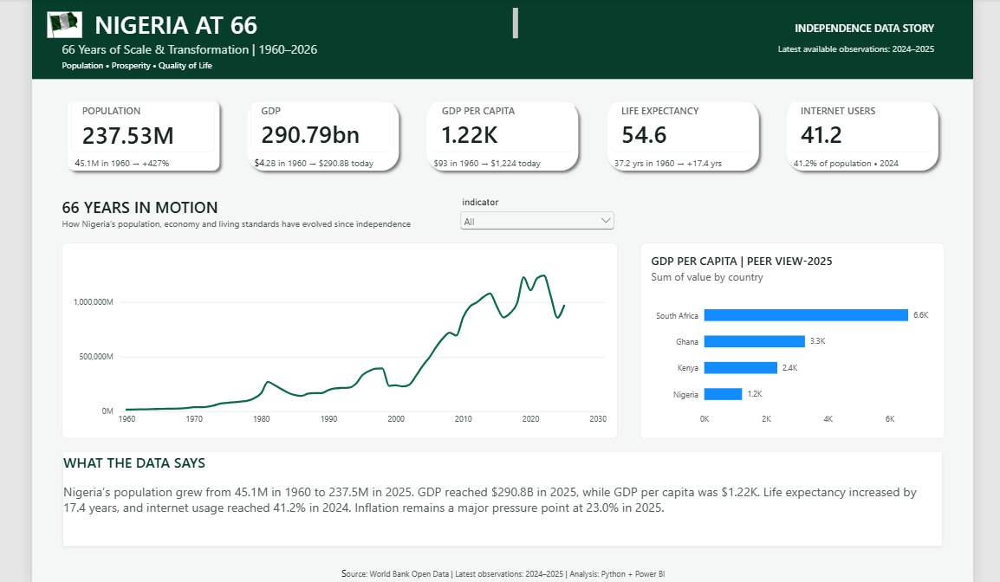

# 🇳🇬 Nigeria at 66
### 66 Years of Scale & Transformation | 1960–2026

An end-to-end data analytics project exploring Nigeria's demographic, economic and human-development transformation since independence using **World Bank Open Data, Python and Power BI**.



---

## 📊 Project Overview

Nigeria gained independence in 1960. This project uses more than six decades of historical data to examine how the country has changed across five major dimensions:

- Population
- GDP
- GDP per capita
- Life expectancy
- Internet adoption

Inflation and unemployment are also analysed as supporting economic indicators.

The project combines **API data extraction, Python data preparation, exploratory analysis and Power BI visualisation** into a single executive-style data story.

---

## 🔍 Questions Explored

This analysis investigates:

- How much has Nigeria's population grown since 1960?
- How has the size of the economy changed?
- Has GDP per person kept pace with national economic scale?
- How has life expectancy evolved?
- How quickly has Nigeria adopted the internet?
- What economic pressures remain?
- How does Nigeria compare with Ghana, Kenya and South Africa?

---

## 💡 Key Findings

| Indicator | Earlier observation | Latest observation |
|---|---:|---:|
| Population | 45.1M (1960) | 237.5M (2025) |
| GDP | $4.2B (1960) | $290.8B (2025) |
| GDP per capita | $93 (1960) | $1,224 (2025) |
| Life expectancy | 37.2 years (1960) | 54.6 years (2024) |
| Internet users | ~0% (1990) | 41.2% (2024) |
| Inflation | 5.4% (1960) | 23.0% (2025) |

### The bigger story

Nigeria's population increased by approximately **427%**, growing from about 45 million people in 1960 to more than 237 million.

Nominal GDP expanded substantially, but the GDP-per-capita comparison shows why economic scale and individual economic outcomes should not be treated as the same thing.

Life expectancy improved by approximately **17.4 years**, while internet adoption represents one of the country's most significant modern transformations.

Inflation remains an important economic pressure point, reaching approximately **23% in 2025** in the dataset.

---

## 🌍 Peer Comparison

Nigeria was compared with:

- 🇬🇭 Ghana
- 🇰🇪 Kenya
- 🇿🇦 South Africa

The peer analysis provides context around economic scale, GDP per capita, population and selected development indicators.

---

## 🛠️ Tech Stack

**Python** — API extraction and data preparation  
**Pandas** — cleaning, transformation and validation  
**Requests** — World Bank API integration  
**Jupyter Notebook** — exploratory analysis  
**Power BI** — modelling, KPI design and interactive visualisation  
**Git & GitHub** — version control and project documentation

---

## 🔄 Data Pipeline

```text
World Bank API
      ↓
Python extraction
      ↓
Raw CSV dataset
      ↓
Data validation & transformation
      ↓
Power BI-ready dataset
      ↓
Power BI dashboard
      ↓
Executive data story
```

The extraction pipeline is contained in:

```text
src/fetch_world_bank.py
```

The final Power BI-ready dataset is:

```text
data/processed/nigeria_at_66_powerbi.csv
```

---

## 📁 Project Structure

```text
nigeria-at-66/
│
├── dashboard/
│   └── naija_powerbi.pbix
│
├── data/
│   ├── processed/
│   │   └── nigeria_at_66_powerbi.csv
│   └── raw/
│       └── world_bank_indicators.csv
│
├── images/
│   └── NIGERIA_AT_66.png
│
├── src/
│   └── fetch_world_bank.py
│
├── .gitignore
├── README.md
└── requirements.txt
```

---

## 📈 Dashboard Design

The Power BI dashboard was designed as a **single-page executive data story** rather than a traditional multi-page report.

It combines:

- headline KPI cards
- 66-year historical trend analysis
- interactive indicator selection
- peer-country benchmarking
- concise analytical commentary

The goal is to allow both technical and non-technical audiences to understand the main story quickly.

---

## ⚠️ Analytical Notes

The latest available year differs between indicators, primarily **2024–2025**.

GDP and GDP-per-capita figures use **current US dollars**. They are therefore affected by inflation, exchange-rate movements and historical data revisions and should not be interpreted as measures of real economic growth on their own.

Missing observations were retained where appropriate rather than artificially imputed.

---

## 📚 Data Source

**World Bank Open Data / World Development Indicators**

Indicators used include population, GDP, GDP per capita, life expectancy, inflation, internet usage and unemployment.

---

## 👤 Author

**Anuoluwapo Emmanuel Abolade**

Data Analyst | Business Intelligence | Python | SQL | Power BI

GitHub: **@aboladvisuals**

---

## ⭐ Project Purpose

This project demonstrates practical skills in:

**API Integration → Data Validation → Python Analysis → Data Transformation → Business Intelligence → Data Storytelling**

It was built as a portfolio project demonstrating the ability to turn public data into a concise, management-ready analytical product.